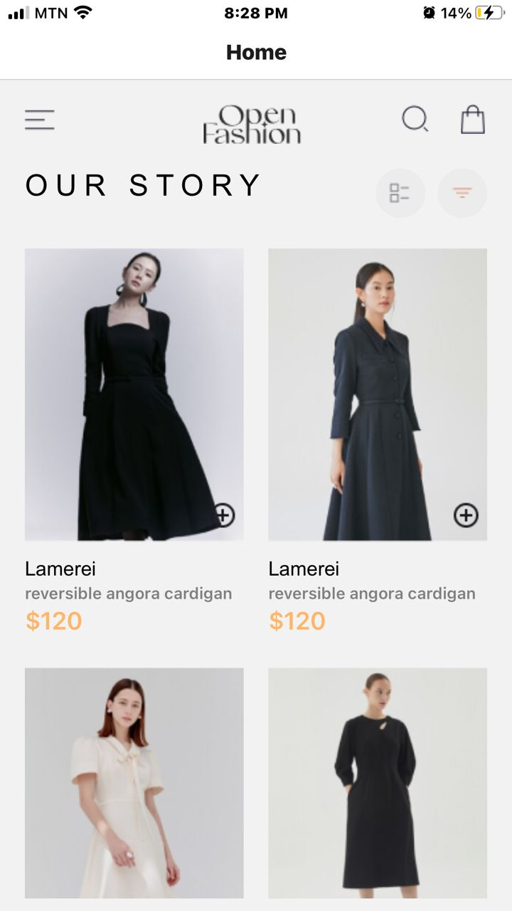
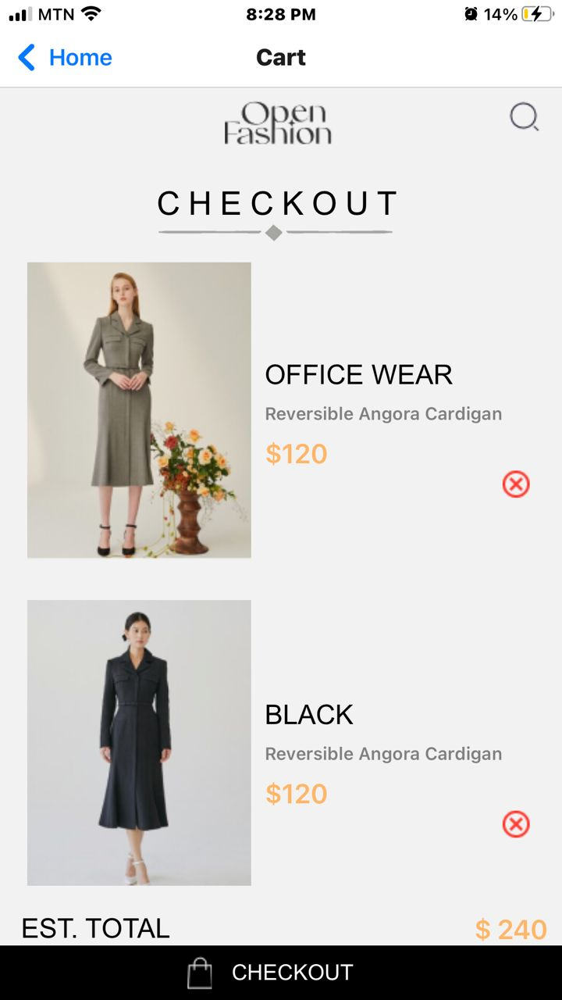

# rn-assignment6-11313275

# Ladies Wear App

## Overview

This is a React Native application for a supermarket that allows users to browse products and add them to their cart. The cart items are stored locally on the device using AsyncStorage, ensuring that the data persists even after the app is closed and reopened.

## Features

- **Product Listing**: Users can view a list of products.
- **Add to Cart**: Users can add products to their cart.
- **View Cart**: Users can view the items in their cart.
- **Remove from Cart**: Users can remove items from their cart.
- **Local Storage**: Cart items are stored locally on the device using AsyncStorage.

## Design Choices

- **React Native**: Chosen for its ability to build native mobile apps using JavaScript and React.
- **AsyncStorage**: Used for local storage to persist cart data across app sessions.
- **FlatList**: Utilized for rendering the product list efficiently.
- **TouchableOpacity**: Used for creating interactive buttons.

## Implementation Details

### Local Storage

The cart items are stored in local storage using AsyncStorage. When an item is added to the cart, it is saved to AsyncStorage. Similarly, when the cart screen is loaded, it retrieves the items from AsyncStorage.

### Screens

#### HomeScreen

- Displays a list of products.
- Allows users to add products to their cart.
- Stores cart items in AsyncStorage.

#### CartScreen

- Displays the items in the cart.
- Allows users to remove items from the cart.
- Retrieves cart items from AsyncStorage.

### Dependencies

- `@react-native-async-storage/async-storage`: For local storage.

## Screenshots

### Home Screen




### Cart Screen



## Setup and Installation

1. Clone the repository:
    ```bash
    git clone https://github.com/yourusername/supermarket-app.git
    ```
2. Navigate to the project directory:
    ```bash
    cd supermarket-app
    ```
3. Install the dependencies:
    ```bash
    npm install
    ```
4. Start the Metro Bundler:
    ```bash
    npx react-native start
    ```
5. Run the app on your device or emulator:
    ```bash
    npx react-native run-android  # for Android
    npx react-native run-ios      # for iOS
    ```

## Usage

- Navigate to the Home screen to view the list of products.
- Tap the "Add to Cart" button to add a product to your cart.
- Navigate to the Cart screen to view and manage your cart items.

---

### Contact

If you have any questions or feedback, feel free to reach out at anthonyaffulkwabenabroni@gmail.com or Tel: 0559390526.
